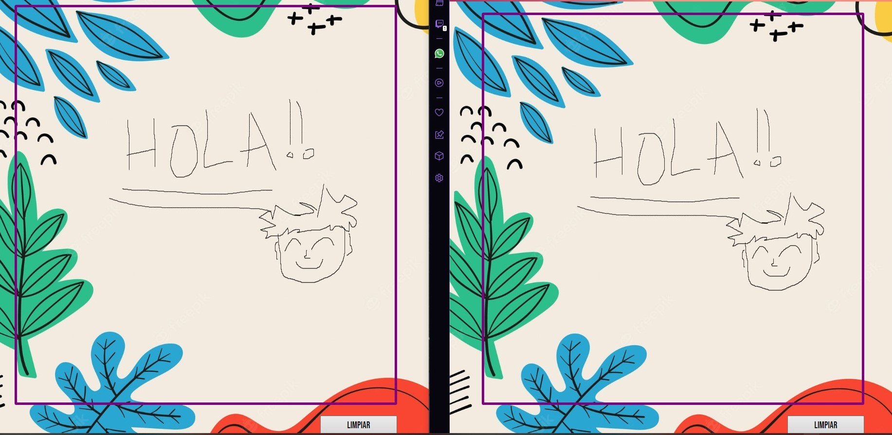

# DrawBoard 📝  
App sencilla en donde varios usuarios pueden dibujar dentro de una misma sala (uso de websockets).

## Tecnologías utilizadas 🚀  
* Angular
* Node con Socket.io

## Requisitos:
Instalar todas las dependencias necesarias con el comando: `npm install`

## Ejecucion en entorno de desarrollo 😎
Lanzar el fron: `ng serve -o`

Lanzar el back: `npm run start`
